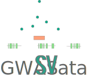

.. GWAS SVatalog documentation master file, created by
   sphinx-quickstart on Tue Feb 28 13:36:49 2023.
   You can adapt this file completely to your liking, but it should at least
   contain the root `toctree` directive.

Welcome to GWAS SVatalog's documentation!
=========================================

**GWAS SVatalog** is a web tool that allows the user to visualize structural variants (SVs) and single nucleotide polymorphisms (SNPs) in high linkage disequilibrium (LD). The software is availible here (insert link to tool).

.. note::

   This project is under active development.

Filters
-------

The filters are used to subset the SVs based on the chosen criteria. There are three ways to accomplish this:

* **Gene**: select chromosome and/or gene of interest.

  * The SVs displayed are within 100kb of the start and end of the gene chosen.

* **Genomic Region**: select chromosome and/or base pair range.

  * The SVs displayed are within the region chosen.

* **Phenotype**: select phenotype of interest depicted in the GWAS Catalog database.

  * If the SNP associated with this phenotype has linkage disequilibrium inforamtion with an SV, these SVs will be displayed. If a phenotype is chosen along with the gene or genomic region filter, both criteria will be used to subset the SV list.

..
   Add image of filter section here

SV Table
--------

The default table contains all the SVs identified in *Homo sapiens*, as described in (insert citation to paper). The table will automatically update based on the filters selected, as explained in `Filters`_.

The user will need to select an SV of interest to generate the interactive plot showcasing the SNPs in LD.

..
   Add image of SV table section here

SV Annotation Table
--------------------

Based on the SV selected in `SV Table`_, this table will display the corresponding annotations for the SV region. :doc:`This document <annotation>` explains the meaning of each column in detail.

..
   Add image of annotation table section here

Interactive LD Plot
--------------------

This plot shows the chosen SV and its SNPs in LD. It will autopopulate when a SV is chosen from `SV Table`_. 

There are two main ways the visualization can be displayed:

1. Selection of phenotype:

   * The plot will be against the p-value found in the GWAS Catalog.
   * The plot will display all the associated SNPs in the GWAS Catalog for that phenotype and highlight the SNPs in linkage with the SV.
   * The SNPs will be highlighted based on the D' or R\ :sup:`2` colocalization value with the SV selected. These measures can be selected by using the toggle switch.

..
   Add image of plot type here

2. Without the selection of phenotype:

   * The plot will be against the D' or R\ :sup:`2` colocalization value with the SV selected. These measures can be selected by using the toggle switch.
   * The plot will display all SNPs available in the colocalization dataset. 

When a SNP in the plot is clicked, the GWAS Catalog information for that SNP will be displayed in the `SNP Table`_ under the plot

..
   Add image of plot type here

SNP Table
----------

This table will be populated based on the SNP selected in the plot. The information provided in this table comes from a combination of the LD data and GWAS Catalog data:

  * **Chromosome**: chromosome
  * **SNP Position**: base pair location on chromosome
  * **SNP Name: dbSNP**: rsID from dbSNP for the genomic location
  * **SNP Name: GWAS**: rsID from the GWAS Catalog entry
  * **Reference Allele**: reference allele from hg38
  * **Alternate Allele**: allele of SNP (each allele availible has been evaluated separately during the LD calculation)
  * **Risk Allele**: risk allele provided by GWAS Catalog
  * **Risk AF**: risk allele frequency provided by GWAS Catalog
  * **Sample AF**: allele frequnency from the samples used during calculation (*insert citation of paper*)
  * **gnomAD NFE AF**: alelle frequency provided by gnomAD for the Non-Finnish European population (closely resembles demographic from the samples used in *insert citation of paper*)
  * **Phenotype**: disease/trait provided by GWAS Catalog
  * **P-Value**: statistic provided by GWAS Catalog
  * **Study**: name of the study from which this entry is derived
  * **Pubmed Link**: PubMed link to the research paper for this entry

Data on the SNPs visible in the interactive plot can be downloaded as a .csv file when clicking the "Export SNP Data" button to the right of the visualziation. In addition to the columns noted above, supplemnetary information on the SV is also included:

  * **SV Name**: name of the structural variant
  * **SV Start**: start base pair location
  * **SV End**: end base pair location
  * **SV Type**: type of indel (insertion, deletion, duplication or inversion)
  * **SV AF**: allele frequency of the SV from the samples used during calculation (*insert citation of paper*)
  * **R**\ :sup:`2`: LD statistic - square of the correlation coefficient between the SV and SNP
  * **D'**: LD statistic - measure of predictability of the SV and SNP based on one another

.. toctree::
   :maxdepth: 2
   :caption: Table of Contents:

.. Indices and tables
.. ==================

.. * :ref:`genindex`
.. * :ref:`modindex`
.. * :ref:`search`

