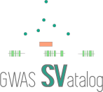

.. GWAS SVatalog documentation master file, created by
   sphinx-quickstart on Tue Feb 28 13:36:49 2023.
   You can adapt this file completely to your liking, but it should at least
   contain the root `toctree` directive.

.. image:: SKlogo.png
   :target: index.html
   :scale: 75 %
   :align: right
   :alt: sklogo

Welcome to GWAS SVatalog's documentation!
=========================================

**GWAS SVatalog** is a web-based browsing and visualization tool that fascilitates fine-mapping of GWAS loci with structural variations (SVs). It is part of the |software_link| suite of software tools specializing in the analysis of GWAS fine-mapping. The SVatalog allows the user to visualize linkage disequilibrium (LD) between SVs and GWAS-associated SNPs. The software is availible |location_link|.

.. |software_link| raw:: html

   <a href="https://locusfocus.research.sickkids.ca/" target="_blank">LocusFocus</a>

.. |location_link| raw:: html

   <a href="https://svatalog.research.sickkids.ca" target="_blank">here</a>

.. admonition:: Disclaimer

   Database constructed from predominantly European population of 101 individauls with Cystic Fibrosis (CF). The alleles affected by CF aside, the remainder of the genome is comparable to a healthy population of European descent (*link to publication TBD*). Genomic location is referenced against GRCh38.

.. toctree::
   :maxdepth: 2
   :caption: Table of Contents:

   usage_examples
   reference_contact
   license

.. Indices and tables
.. ==================

.. * :ref:`genindex`
.. * :ref:`modindex`
.. * :ref:`search`

