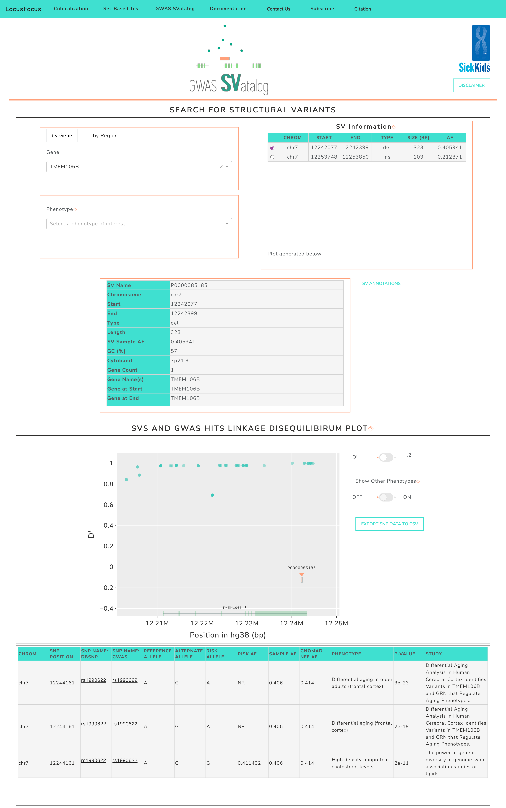

.. GWAS SVatalog documentation master file, created by
   sphinx-quickstart on Tue Feb 28 13:36:49 2023.
   You can adapt this file completely to your liking, but it should at least
   contain the root `toctree` directive.

.. image:: tcaglogo.png
   :target: index.html
   :scale: 50 %
   :align: right
   :alt: tcaglogo

GWAS SVatalog
==============

**GWAS SVatalog** is a web-based browsing and visualization tool that fascilitates fine-mapping of GWAS loci with structural variations (SVs). It is part of the |lf_link| suite of software tools specializing in the analysis of GWAS fine-mapping. The SVatalog allows users to visualize linkage disequilibrium (LD) between SVs and GWAS-associated SNPs found in |gwas_link|. The software is availible |svatalog_link|.

.. |lf_link| raw:: html

   <a href="https://locusfocus.research.sickkids.ca/" target="_blank" style="color:#2ba089">LocusFocus</a>

.. |svatalog_link| raw:: html

   <a href="https://svatalog.research.sickkids.ca" target="_blank" style="color:#2ba089">here</a>

.. |gwas_link| raw:: html

   <a href="https://www.ebi.ac.uk/gwas/" target="_blank" style="color:#2ba089">GWAS Catalog</a>

   Screenshot of GWAS SVatalog.

.. admonition:: Disclaimer

   Database constructed from predominantly European population of 101 individauls with Cystic Fibrosis (CF). The alleles affected by CF aside, the remainder of the genome is comparable to a healthy population of European descent (*link to publication TBD*). Genomic location is referenced against GRCh38.

.. toctree::
   :maxdepth: 2
   :caption: Table of Contents:

   index
   usage_examples
   reference_contact
   license

.. Indices and tables
.. ==================

.. * :ref:`genindex`
.. * :ref:`modindex`
.. * :ref:`search`

