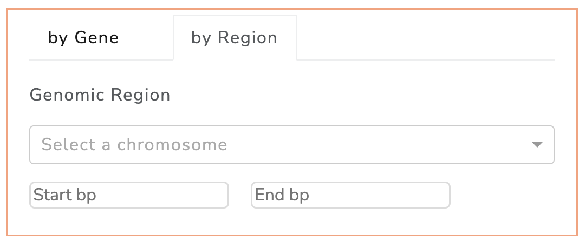
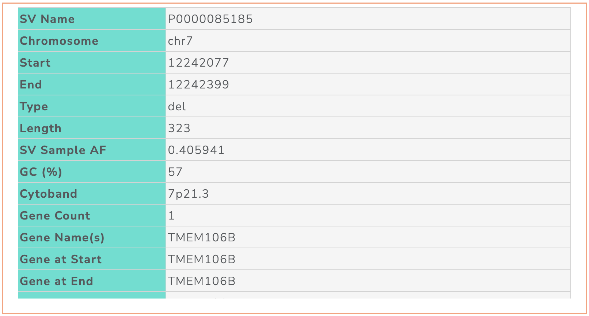
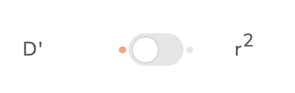
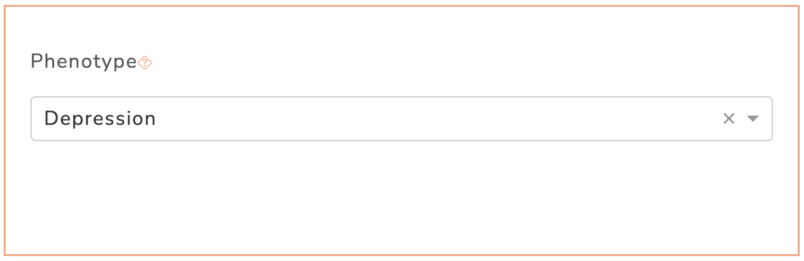
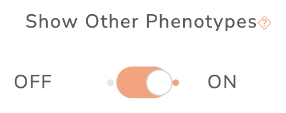
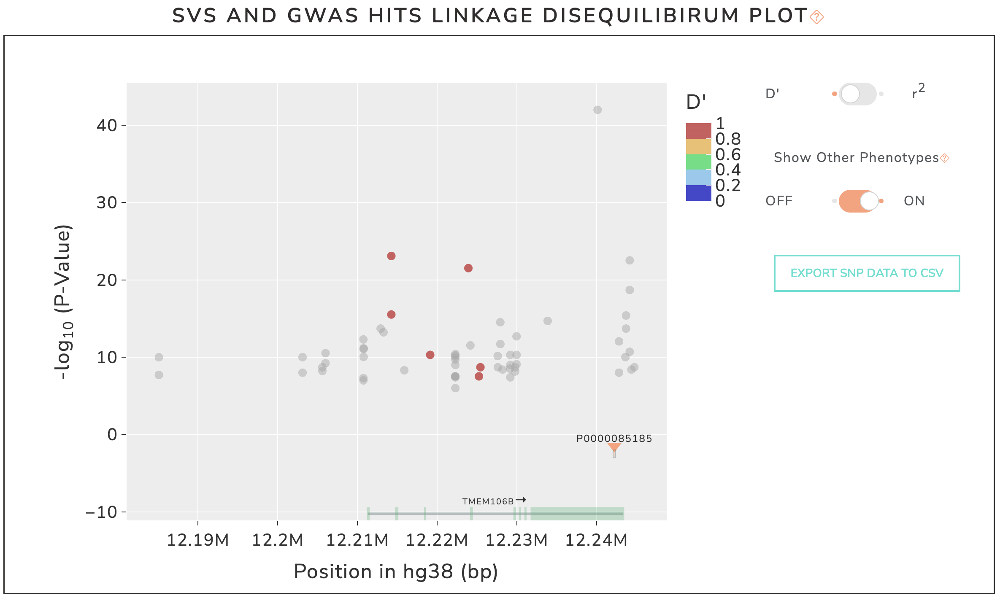

Usage and Examples
=========================================

GWAS SVatalog provides two ways to obtain the end goal of fine-mapping GWAS loci using structural vairants.

1. Choosing a **genomic region** of interest

2. Selecting a **phenotype** of interest with/without a specific loci

   Screenshot of **filter section** availible to **subset SV list** in GWAS SVatalog.

1. Genomic Region
------------------

This method subsets the list of structural variants solely by the genomic region of interest.    

Selecting by Coordinates
^^^^^^^^^^^^^^^^^^^^^^^^

Simply selecting chromosome of interest and/or entering the desired range.

   Screenshot of **genomic region** filter in GWAS SVatalog.

Selecting by Gene
^^^^^^^^^^^^^^^^^^

When selecting a gene of interest, the SVs displayed are within 100kb of the start and end of the gene chosen.

   Screenshot of **gene** filter in GWAS SVatalog.

.. _sv selection:

Selecting an SV
^^^^^^^^^^^^^^^^

The 35,855 structural variants in this table are subsetted by the filters applied. Each row is a unique SV with MAF ≥ 0.1.    

Select a SV to analyze further.

   Screenshot of the **SV information table** in GWAS SVatalog.

.. _sv anno:

SV Annotations
^^^^^^^^^^^^^^^

Annotations generated for the selected SV are displayed here. :doc:`This document <annotation>` explains the meaning of each column in detail. 

   Screenshot of the **SV annotation table** in GWAS SVatalog.

.. _plot no pheno:

Interactive Plot
^^^^^^^^^^^^^^^^

The visualization shows the selected SV and linkage disequilibrium statistics (D'/r\ :sup:`2`) for SNPs within 1 Mb of its boundries. These SNPs are significant with genome-wide association studies studies as depicted in |gwas_link|.
Each marker is a unique SNP where the hover label shows information on one entry in GWAS Catalog. When a SNP is clicked, a table below populates with additional information (see :ref:`table snp`).    

The default LD statistic is D', the toggle can be used to visualize r\ :sup:`2` on the y axis if required. 

   Screenshot of **D' to r**\ :sup:`2` toggle button for the interactive plot in GWAS SVatalog.

The representative transcript for each gene obtained from |mane_link| are shown in the plot. The direction of the arrow beside each gene name represents the direction of the transcript. The user can additionally download information of the SNPs shown in the plot as a .csv file when clicking the "Export SNP Data to CSV" button to the right of the visualziation. See :ref:`table snp` for column descriptions.

.. |gwas_link| raw:: html

   <a href="https://www.ebi.ac.uk/gwas/" target="_blank" style="color:#2ba089">GWAS Catalog</a>

.. |mane_link| raw:: html

   <a href="https://useast.ensembl.org/info/genome/genebuild/mane.html" target="_blank" style="color:#2ba089">MANE</a>

   Screenshot of **interactive plot** in GWAS SVatalog.

.. _table snp:

SNP Table
^^^^^^^^^^

This table is populated based on the SNP selected in the plot. The SNP information is a combination of GWAS Catalog entries and linkage disequilibrium statistics for the selected SV.

   Screenshot example of **selecting a SNP** in the plot and **populating the SNP table** in GWAS SVatalog.

Description of columns seen in the table:

  * **Chromosome**: chromosome number
  * **SNP Position**: base pair location on chromosome (hg38 coordinates)
  * **SNP Name: dbSNP**: rsID from dbSNP
  * **SNP Name: GWAS**: rsID from the GWAS Catalog entry
  * **Reference Allele**: reference allele from hg38
  * **Alternate Allele**: alternate allele
  * **Risk Allele**: risk allele provided by GWAS Catalog
  * **Risk AF**: risk allele frequency provided by GWAS Catalog
  * **Sample AF**: allele frequnency from 101 sample cohort (*insert citation of paper*)
  * **gnomAD NFE AF**: alelle frequency provided by gnomAD for the Non-Finnish European population
  * **Phenotype**: disease/trait provided by GWAS Catalog
  * **P-Value**: statistic provided by GWAS Catalog
  * **Study**: name of the study from which this entry is derived
  * **Pubmed Link**: PubMed link to the research paper for this entry

Additional columns in the download file:

  * **SV Name**: name of the structural variant
  * **SV Start**: start base pair location
  * **SV End**: end base pair location
  * **SV Type**: type of indel (insertion, deletion, duplication or inversion)
  * **SV AF**: allele frequency of the SV from the samples used during calculation (*insert citation of paper*)
  * **r**\ :sup:`2`: LD statistic - square of the correlation coefficient between the SV and SNP
  * **D'**: LD statistic - measure of predictability of the SV and SNP based on one another
  * **P-Value_log10**: log10 of the statistic provided by GWAS Catalog

2. Phenotype
-------------

This method subsets the list of structural variants by the phenotype of interest. These SVs have linkage disequilibrium statistics with at least one GWAS-significant SNP for the selected phenotype.    

Selecting by Phenotype
^^^^^^^^^^^^^^^^^^^^^^^^

The list of phenotypes have been obtained from |gwas_link|.

.. |gwas_link| raw:: html

   <a href="https://www.ebi.ac.uk/gwas/" target="_blank" style="color:#2ba089">GWAS Catalog</a>

   Screenshot of **phenotype** filter in GWAS SVatalog.

Selecting by Genomic Loci
^^^^^^^^^^^^^^^^^^^^^^^^^

In addition to selecting a phenotype, the user can optionally subset the list of SVs further by choosing a genomic region or gene of interest (see `Selecting by Coordinates`_ and `Selecting by Gene`_).

Selecting an SV
^^^^^^^^^^^^^^^^

:ref:`sv selection`

SV Annotations
^^^^^^^^^^^^^^^

:ref:`sv anno`

Interactive Plot
^^^^^^^^^^^^^^^^

The visualization shows the selected SV and p-value of GWAS-associated SNPs for the chosen phenotype. These SNPs are significant with genome-wide association studies studies as depicted in |gwas_link|. The color of each SNP marker is based on the D' statistic with the selected SV. The user has an option to switch the color to depict r\ :sup:`2` instead by clicking the toggle to the right. 

.. |gwas_link| raw:: html

   <a href="https://www.ebi.ac.uk/gwas/" target="_blank" style="color:#2ba089">GWAS Catalog</a>

   Screenshot of **D' to r**\ :sup:`2` toggle button for the interactive plot in GWAS SVatalog.

The user also has an option to visualize p-value for SNPs from other phenotypes within 100 kb of the current region.
The linkage disequilibrium statistics  (D'/r\ :sup:`2`) between each of these SNPs and the selected SV will be displayed in the hover label.

   Screenshot of **show other phenotype** toggle button for the interactive plot in GWAS SVatalog.

The representative transcript for each gene obtained from |mane_link| are shown in the plot. The direction of the arrow beside each gene name represents the direction of the transcript. The user can additionally download information of the SNPs shown in the plot as a .csv file when clicking the "Export SNP Data to CSV" button to the right of the visualziation. See :ref:`table snp` for column descriptions.

.. |mane_link| raw:: html

   <a href="https://useast.ensembl.org/info/genome/genebuild/mane.html" target="_blank" style="color:#2ba089">MANE</a>

   Screenshot of **interactive plot** after selecting a specific phenotype in GWAS SVatalog.

SNP Table
^^^^^^^^^^

:ref:`table snp`